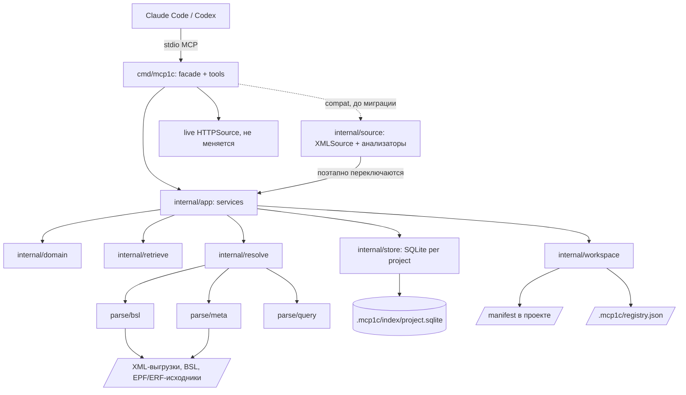
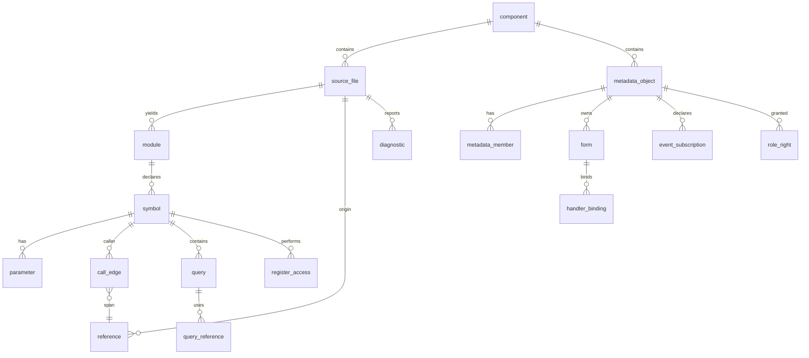

# Архитектура: 1c-workflow как единый индексный MCP для 1С

Статус: **принята**. Документ описывает целевую архитектуру индексного ядра; сводка
существенных изменений: приложение B. Точный DDL всех таблиц в документ не входит: он результат
storage-фазы, здесь зафиксированы семантические инварианты (классы ON DELETE, XOR-автомат
reference, aspect-модель, поколения/эпохи). Документ фиксирует целевую архитектуру; фактическое
состояние реализации: код и ADR (`docs/adr/`).

Маркировка утверждений: **[код]** подтверждено кодом на момент аудита (раздел 4), **[решение]**
принятое решение (D0-D6, приложение A), **[арх]** архитектурное решение этого документа,
**[гипотеза]** требует benchmark, **[spike]** требует spike, **[открыто]** требует отдельного
решения.

Пути к коду указаны относительно корня репозитория; пути serena-bsl (форк Serena с поддержкой
BSL) относительно корня его сборки.

## 1. Executive summary

Существующий `1c-workflow` эволюционирует в единый локальный MCP-сервер со структурной
моделью проекта 1С: персистентный SQLite-индекс символов BSL, метаданных, запросов, регистров,
форм, подписок и прав, поверх которого работают и новые composable-примитивы (`find_symbol`,
`find_references`, `trace_call_graph`), и все существующие workflow-инструменты. Один процесс,
stdio, pure-Go (`CGO_ENABLED=0`), один SQLite-файл на logical project, версионируемый манифест
проекта отдельно от локального registry. Первая веха: Serena-parity core по основной
конфигурации с сравнительными evaluations; Serena отключается отдельной вехой после доказанного
паритета. Два ADR (SQLite-драйвер, стратегия парсера BSL) закрываются spike-ами до начала
соответствующих фаз. Существующая 1С-семантика анализаторов (порядок событий записи, ИЛИ-логика
прав, стиль проведения и пр.) мигрирует на индекс, не переписывается с нуля.

## 2. Конечный пользовательский результат

Claude Code, Codex и другие агенты получают минимальный, достаточный, проверяемый контекст по
задаче без чтения целых модулей и XML: точные определения и ссылки с source spans,
типизированный граф зависимостей BSL и метаданных, provenance и confidence у каждого факта,
свежесть через инкрементальную индексацию, и `get_context_for_task` как воспроизводимый
retrieval поверх всего этого. «Лучшесть» решения не постулируется: она доказывается
benchmark-ами и сравнительными agent evaluations против Serena (раздел 30).

## 3. Вердикт: один MCP **[решение D0]**

Один процесс. Аргументы против двух: (1) владелец active project, generation и кэшей должен
быть один, иначе рассинхронизация поколений между процессами становится штатным режимом;
(2) два процесса гарантируют двойной XML/BSL-парсинг либо IPC-протокол поверх индекса, который
сам по себе дороже фасада; (3) `newServer` (`cmd/mcp1c/tools.go:286`) уже является composition
root, куда индексное ядро подключается без процессной границы; (4) ни одно требование (изоляция
сбоев, независимый деплой, другой язык) здесь не присутствует. Вариант B отвергнут.

## 4. Подтверждённый аудит текущего кода

Все девять предварительных выводов подтверждены **[код]**:

1. `XMLSource` это `struct { root string }`, читает по требованию, пересоздаётся на каждый
   вызов: `internal/source/xmlsource.go:19`, `cmd/mcp1c/tools.go:85-92`.
2. `SearchCode` делает `WalkDir` по всем `.bsl` на каждый поиск:
   `internal/source/xmlsource.go:273`.
3. Кэш процесс-глобальный, stamp «число файлов + max mtime» (`internal/source/cache.go:38`),
   покрывает только подписки, функциональные опции и права ролей. Мимо кэша:
   `internal/source/usages.go:110` читает 1087 `Rights.xml` напрямую;
   `internal/source/deppaths.go:86-101` обходит все XML конфигурации на каждый вызов;
   `internal/source/extension.go:85-89` читает каждый `.bsl` выгрузки;
   `internal/source/extpoints.go:60-76` читает все переопределяемые модули;
   `internal/source/postingreview.go:135` перечитывает те же файлы через `Movements()`.
4. `context_pack` агрегирует четыре независимых анализатора:
   `internal/source/contextpack.go:66-108`.
5. Экспортные методы: две несовместимые эвристики (`internal/source/contextpack.go:16`
   обрывается на первой `)`; `internal/source/extpoints.go:200` склеивает многострочные
   заголовки). Всего четыре регулярки заголовка процедуры, три обхода графа локальных вызовов
   (глубины 4, 3 и без лимита), побайтово одинаковые регулярки снятия литералов в
   `writepath.go:417` и `postingreview.go:70`.
6. `ConfigSource` содержит 5 методов (`internal/source/source.go:10-26`); все анализаторы
   обходят его кастом `provide().(*source.XMLSource)` (`cmd/mcp1c/contextpack.go:25`).
   Абстракция подтверждённо узка.
7. Парсера запросов нет: `queryadvisor.go:62` честно эвристичен, `queryschema.go` выводит
   схему из свойств объекта (намеренно, `:28-31`), `postingreview.go:76` обнуляет тексты
   запросов.
8. Ценная семантика (сохранить обязательно): порядок событий записи и «обработчик модуля до
   подписок» (`writepath.go:47-55`, `:202-205`); подписки на голый вид и `ОпределяемыйТип`
   (`:135-143`, 128 из 308 подписок УТ); права и RLS по ИЛИ, `setForNewObjects`
   (`rightsaudit.go:85-90`, `:220-227`); ИЛИ-логика функциональных опций и опции подсистем
   (`visibility.go:380-389`); `CommandInterface.xml` как граница доступа
   (`commandvisibility.go:13-17`); стиль проведения inline/delegated (168/280 документов УТ
   делегируют, `postingreview.go:32-39`); три механизма регистрации обменов
   (`exchangeaudit.go:28-43`); порядок измерений как составной индекс
   (`queryadvisor.go:289-333`); лестница точек расширения (`extpoints.go:38-41`); семантика
   `ИзменитьРеквизиты` (`formconflicts.go:142-145`).
9. serena-bsl переносить как основу точного индекса нельзя: 6 регулярок без лексера
   (`src/solidlsp/bsl_parser.py:61-105`), директива компиляции теряется всегда, `Асинх` и
   английский синтаксис не распознаются, метод без `КонецПроцедуры` молча выбрасывается,
   вызовы ловятся в комментариях и строках, references по голому имени без квалификатора с
   регистрозависимыми ключами при регистронезависимом языке, call-индекс не переживает рестарт
   (на прогретом кэше `find_references` возвращает пусто). Переносимы только идеи: батч-обход,
   hash-инкрементальность, отображение путь -> модуль.

## 5. Scope первой версии и отложенное **[решение D5]**

**Веха 1 (Serena-parity core):** `find_symbol`, `get_symbol` (сигнатура или ограниченное тело),
`get_module_structure`, `find_references`, callers/callees, базовый `trace_call_graph`, точные
spans, diagnostics для ambiguous/unresolved, `index_status`/`reindex`; основная конфигурация без
effective view расширений; поверх нового персистентного индекса. DoD: шесть пунктов из decision
log (приложение A, D5), включая эквивалентность инкремента и clean rebuild и сравнительные
evaluations с Serena.

В веху также входят: минимальный **module registry**
(свойства общих модулей из их XML: Global, Server, ClientManagedApplication, ServerCall,
Privileged, ExternalConnection; принадлежность модулей объектам) и **resolver-семантика 1С**
раздела 19.1 (глобальные модули, экспортность, контексты, manager-вызовы, platform builtins).
Без них Serena-parity не засчитывается. Это расширение состава вехи входит в решение D5.

**Явно отложено:** embeddings (только fallback/reranking, не источник истины, фаза 16);
rename/refactoring; effective view расширений (модель в схеме с первого дня, реализация
фаза 12); массовая миграция workflow-инструментов (последовательно после стабилизации
примитивов); `get_context_for_task` (после надёжных references и графа); отключение Serena
(отдельная веха); live-режим не трогается вовсе; полнотекст по коду через FTS5 (фаза миграции
`search_code`, до того `search_code` работает по-старому); СКД-глубокий разбор и MXL.

## 6. Границы компонентов и направление зависимостей **[арх]**

```
cmd/mcp1c            composition root + MCP transport + регистрация tools
internal/app         application services (use cases): SymbolService, GraphService,
                     MetadataService, RetrievalService, IndexService, WorkspaceService
internal/domain      сущности и инварианты: Project, Component, Generation, Symbol,
                     Reference, Edge, Provenance, Confidence (ноль внешних зависимостей)
internal/parse/bsl   лексер/парсер BSL (или адаптер выбранного по ADR-3) -> факты со spans
internal/parse/meta  единый XML-парсер метаданных (миграция xmltypes + всех ad-hoc типов)
internal/parse/query парсер запросов 1С (tolerant, классификация статичности)
internal/resolve     резолвер имён: definitions, references, call graph, BSL<->metadata
internal/store       SQLite: schema, migrations, generations, prepared statements
internal/retrieve    get_context_for_task: intents, anchors, expansion, scoring, packing
internal/workspace   манифест (read/validate), local registry, discovery, component typing
internal/source      СУЩЕСТВУЮЩИЙ слой: XMLSource, live HTTPSource, анализаторы.
                     Роль: adapter/compatibility. Анализаторы поэтапно переключаются
                     с прямых чтений на internal/app, семантика переезжает в app/domain.
```

Направление зависимостей: `cmd/mcp1c -> app -> domain`; `app -> store, resolve, parse/*,
workspace, retrieve`; `store/resolve/parse -> domain`. Запрещено (тест на import-граф):
`domain` -> MCP SDK; SQL вне `store`; второй XML-парсер одной сущности (единственная точка
`readXML` сегодня уже есть, `internal/source/xmltypes.go:279`, она переезжает в `parse/meta`);
regex как скрытый источник «точных» фактов (эвристика обязана записывать `confidence < 1`);
глобальный mutable active index (доступ только через generation snapshot); silent fallback на
stale (warning обязателен); embeddings как доказательство связи.

Проверка против кода: структура ложится на существующую. `cmd/mcp1c` уже только фасад
**[код]**; `internal/source` уже отделён; конфликтов имён пакетов нет (легаси-пакеты
`internal/onec`, `internal/standards`, `internal/syntax`, `internal/validate` остаются как
есть; перечень на момент аудита, часть легаси-пакетов позже удалена).

## 7. Component diagram



## 8. Модель workspace -> project -> component **[решение D2, D3]**

- **Workspace**: каталог, заданный `--projects-root`. Никогда не индексируется рекурсивно
  как один проект.
- **Logical project**: основная конфигурация плюс явно привязанные к ней компоненты.
  Независимые конфигурации это разные проекты. Один SQLite-файл на проект.
- **Component**: типизированный корень. Виды v1-модели: `configuration`, `extension`,
  `external-data-processor`, `external-report`, `test-sources`, `standalone-bsl`. Поля: `id`
  (stable, слаг), `project`, `kind`, `root` (канонический путь), `appliesTo` (для расширений:
  id конфигурации), `applyOrder` (порядок применения расширений), `include`/`exclude`,
  состояние индекса (в registry, не в манифесте). Каждый факт индекса несёт `project_id` и
  `component_id`.

**Два объекта состояния [решение D3]:**

1. **Манифест проекта**: декларативный, принадлежит проекту, версионируется в Git, сервер
   читает и валидирует, создаёт и меняет только по явной команде (`workspace_register` или
   правка руками). Никаких скрытых изменений при обычном MCP-запросе.
2. **Local registry** (`.mcp1c/registry.json`): active project, известные пути, последние
   проекты, расположение и поколения индексов. Ведёт сервер. `.mcp1c/` целиком:
   сгенерированное состояние, в `.gitignore`, исключён из индексации, удаление ведёт только к
   перестроению; SQLite не source of truth **[решение D2]**.

`set_dump <путь>` сохраняет поведение и регистрирует временный single-component проект только
в registry. Autodiscovery (`list_projects`, поиск `Configuration.xml`, определение расширения по
`ConfigurationExtensionPurpose` **[код]** `internal/source/xmlsource.go:60`) только предлагает
кандидатов и связи; связывание всегда явное. Проверка типа компонента:
`configuration`/`extension` по `Configuration.xml`; EPF/ERF по корневому XML разобранной
обработки/отчёта (skills `epf-dump`/`erf-dump` дают исходники; бинарные `.epf` не
индексируются); `test-sources` и `standalone-bsl` только объявлением. Nested и duplicate roots:
регистрация корня внутри уже зарегистрированного корня того же проекта отклоняется с
диагностикой; `findProjects` уже не спускается внутрь найденных экспортов **[код]**
`cmd/mcp1c/projects.go:62`. Незарегистрированные исходники не индексируются и не читаются;
`index_status` показывает кандидатов от autodiscovery. Не индексируются по умолчанию:
`AGENTS.md`/`CLAUDE.md`/skills, `.git`, каталоги ИБ, бинарные `.cf/.cfe/.epf/.erf/.dt/.1CD`,
сам `.mcp1c/`, build/dist/logs/temp. Документация проектов, если когда-то понадобится, это
отдельный источник и отдельный retrieval-канал, не symbol index.

Effective project view: конфигурация + расширения в `applyOrder` + компоненты EPF/тестов;
инструмент принимает `component=` для сужения.

## 9. Пример манифеста **[арх]**

Формат JSON (в проекте уже есть прецедент `.v8-project.json` у db-скиллов; YAML отклонён:
лишняя зависимость).

```json
{
  "version": 1,
  "project": "ut-main",
  "displayName": "УТ 11.5 (доработки)",
  "components": [
    { "id": "cfg",      "kind": "configuration",          "root": "dumps/ut_main" },
    { "id": "ext-fix",  "kind": "extension",              "root": "dumps/ext_fix",
      "appliesTo": "cfg", "applyOrder": 1 },
    { "id": "ext-ai",   "kind": "extension",              "root": "ai-assist/src",
      "appliesTo": "cfg", "applyOrder": 2 },
    { "id": "epf-load", "kind": "external-data-processor","root": "tools/ЗагрузкаЦен/src",
      "usesConfiguration": "cfg" },
    { "id": "tests",    "kind": "test-sources",           "root": "tests/yaxunit",
      "usesConfiguration": "cfg", "include": ["**/*.bsl"] }
  ],
  "exclude": ["**/logs/**", "**/temp/**"]
}
```

Имя файла: `1c-project.json` в корне проекта (не в `.mcp1c/`, потому что манифест
версионируется). Пути относительны манифесту. **[открыто]** имя файла утверждается при
реализации фазы 2.

## 10. ADR-1: процессная граница

**Решение**: один MCP-процесс **[решение D0]**. Контекст, альтернативы и причины: раздел 3.
Статус: принято, пересмотр только при появлении измеримого требования изоляции.

## 11. ADR-2: embedded storage и драйвер

**Решение**: embedded SQLite, один файл на logical project **[решение D2]**; драйвер:
предварительно `modernc.org/sqlite`, финализация после spike **[решение D1a]**.

Сравнение хранилищ: (1) SQLite: транзакции и crash consistency из коробки, FTS5, migrations,
конкурентное чтение через WAL-снапшоты (это же даёт snapshot consistency для D4), проверяемый
на диске формат; (2) полностью in-memory: повторяет главный дефект Serena (холодный старт =
полная переиндексация УТ при каждом запуске сервера, а MCP-процесс перезапускается часто),
отклонено; (3) собственные бинарные/JSON-файлы: ручная реализация транзакций, частичной
инвалидизации и конкурентного чтения, без FTS; отклонено. Восстановление всегда через rebuild
из XML (SQLite не source of truth **[решение D2]**).

Драйверы: `mattn/go-sqlite3` (CGO) запрещён в production **[решение D1]**;
`modernc.org/sqlite`: pure-Go, WAL и pragma-DSN подтверждены документацией (context7,
12.08.2026), FTS5 входит в транслируемую амальгамацию (проверка в spike);
`zombiezen/go-sqlite` (поверх modernc, низкоуровневый API) кандидат номер два, если
`database/sql`-обёртка окажется узким местом на bulk insert **[spike]**. Spike-план: на
реальной выгрузке УТ измерить bulk insert (один writer, `_txlock=immediate`, батчи в
транзакциях), FTS5-построение, concurrent reads при письме (WAL), migrations, размер файла,
cold/warm. Лицензии: modernc BSD-3, приемлемо. Утверждение «вдвое медленнее на записи»
остаётся гипотезой до замера **[решение D1a]**.

Режим: WAL, `synchronous=NORMAL`, `foreign_keys=1`, `busy_timeout`, `_txlock=immediate` для
writer; единственный writer-горутина на проект, читатели без ограничений.

Физическая раскладка: проект хранится в **эпохах**
(`<project>.e<N>.sqlite`); инкрементальные поколения публикуются обычным commit одной
write-транзакции, снапшот читателю даёт его собственная read-транзакция (WAL); полный rebuild
и несовместимая миграция создают новую эпоху; переключение идёт через атомарную запись
маленького файла-указателя, а НЕ через rename поверх открытого SQLite (на Windows
непереносимо: открытые дескрипторы, WAL/SHM). Детали: раздел 18.1. В spike ADR-2 добавляются
проверки: поведение открытых файлов и удаления эпох на Windows (drain + retry), влияние
длинной read-транзакции инструмента на checkpoint и рост WAL при параллельном инкременте,
`auto_vacuum=INCREMENTAL`, скорость `VACUUM INTO` как альтернативного способа снять слепок.

## 12. ADR-3: стратегия BSL-парсера

**Решение**: отложено до сравнительного spike **[решение D1b]**; здесь фиксируются кандидаты,
план и критерии.

Кандидаты: (a) tree-sitter с существующей BSL-грамматикой: качество и error recovery проверены
экосистемой, но runtime это C; в production допустим только через WASM-исполнение
(grammar -> wasm, рантайм `wazero`, pure-Go) **[spike]**: скорость и стоимость такой связки
неизвестны; (b) bsl-language-server: Java, старт ~36 с (наблюдение из эксплуатации Serena),
как обязательная runtime-зависимость отклоняется сразу, но остаётся эталоном в golden-тестах
и опциональным вторым мнением (`bsl-language-server` MCP уже подключён отдельно);
(c) собственный tolerant lexer/parser на Go: полный контроль spans, error recovery и скорости,
максимальная стоимость; принимается только если (a) не пройдёт по производительности/деплою
**[решение D1b]**; (d) гибрид: собственный быстрый индексатор + LSP как выборочная проверка в
тестах (не в runtime).

Spike-чеклист (обязателен): многострочные сигнатуры, сложные default values, комментарии,
строки с экранированием кавычек, директивы компиляции (включая
`&НаКлиентеНаСервереБезКонтекста`), препроцессор `#Если/#Область`, русский и английский
синтаксис, `Асинх`, сломанный или неполный модуль (error recovery без потери остальных
методов), ложные вызовы в строках и комментариях, unqualified и qualified вызовы, точные
byte/line/column spans, cold и incremental parse speed на всём BSL УТ, startup cost, память,
зависимости, лицензии. Corpus: весь BSL УТ + синтетические кейсы + дефектные фикстуры; oracle:
bsl-language-server и tree-sitter (нативный, в тестовом окружении). Выход spike: таблица
precision/recall по символам, параметрам, экспортности, spans; скорость; ADR-3 дописывается
результатом. Регулярки текущего кода в качестве основы отклонены заранее **[код]**: два
парсера экспортов уже расходятся на многострочных сигнатурах.

## 13. ADR-4: модель расширений

**Решение [арх]**: схема данных несёт `component_id` и `layer` (`base` | id расширения) с
первого дня; v1 индексирует расширения как raw-компоненты (символы, ссылки, перехватчики как
факты `intercepts`); effective view (слияние по `applyOrder`: заимствованные, добавленные,
изменённые объекты, добавленные реквизиты, формы расширений,
`&Перед`/`&После`/`&Вместо`/`ИзменениеИКонтроль`) вычисляется на чтении в фазе 12, не
материализуется. Каждый effective-факт несёт provenance (какой слой его дал), конфликты
нескольких расширений (два `&Вместо` на один метод, порядок не определён) выдаются как
diagnostics, повторяя семантику `formconflicts.go` **[код]**. Пределы честно фиксируются:
runtime-порядок применения расширений из XML не выводится, effective view это статическая
модель с `confidence < 1` там, где порядок значим; заимствование «на замке» и safe mode не
моделируются в v1. Парсер аннотаций мигрирует из `internal/source/extension.go:36-45`
(единственная реализация вместо двух).

## 14. Логическая модель данных **[арх]**

Идентичность: канонические пути относительно корня компонента; UUID метаданных из XML;
BSL-имена регистронезависимы: везде пара `name_norm` (lower, NFC) + `name_display`;
`symbol_uid = hash(project, component, module_path, name_norm)` для стабильных внешних ссылок;
`origin` (файл-источник) и `layer` у каждого факта; `resolution` из
{resolved, ambiguous, unresolved, dynamic} — конечный автомат состояний разрешения;
`target_class` определён ТОЛЬКО при resolved и принимает {symbol, metadata, platform}
(оси разделены: dynamic это состояние resolution, а не класс цели; одна и та же
модель в схеме, §15 и API). `confidence` в (0..1] (1 только у фактов от точного
парсера/XML). Generation:
непрозрачный идентификатор вида `e<эпоха>.g<номер>`; хранится счётчиком в meta, снапшот на
время вызова обеспечивает read-транзакция SQLite, историческое чтение старых поколений в v1
не поддерживается (раздел 18.1). Всё, на что могут указывать рёбра графа, живёт в едином
пространстве id таблицы `node` (настоящие FK, раздел 15). **Node = стабильная ЛОГИЧЕСКАЯ
identity, а не факт одного файла**: составные сущности 1С (общий модуль = XML со
свойствами + Module.bsl с кодом; форма = объявление в XML объекта + Form.xml + модуль формы)
собираются из аспектов, каждый аспект принадлежит своему source_file; identity переживает
изменение любого из файлов и удаляется reconciliation-шагом, только когда не осталось ни
одного источника.

Сущности: workspace (registry, вне БД), project, component, index_generation, node (единое
пространство id логических identity), blob (content-addressed образ исходного файла, раздел
18.2), source_file, module + аспекты module_context (свойства из XML) и module_code
(привязка к BSL), symbol, parameter, source_span (встроен колонками: span всегда принадлежит
ровно одному факту), reference, reference_candidate (кандидаты ambiguous-разрешения),
resolution_dep (обратный индекс ключей разрешения, раздел 18.4), call_edge, metadata_object,
metadata_member, form + аспекты form_declaration (объявление в XML владельца) и
form_structure (Form.xml), form_element,
form_command, handler_binding, query, query_reference, register_access, event_subscription,
scheduled_job, role, right (role_right), dependency_edge, text_search_document (FTS5),
diagnostic.

Типизированные таблицы обязательны для связей с собственными атрибутами: `call_edge` (вид
вызова, квалификатор), `reference`, `handler_binding` (событие), `query_reference` (вид:
таблица/поле/параметр/ВТ), `register_access` (режим доступа, транзакционность), `role_right`
(право, RLS, setForNewObjects). Generic
`dependency_edge(kind, from_kind, from_id, to_kind, to_id, provenance, confidence, layer)`
оправдан для связей без атрибутов: подсистема содержит объект, поле типизировано объектом,
план обмена содержит объект, тест ссылается на боевой символ, EPF использует объект
конфигурации. Новый вид связи: сначала в `dependency_edge` с новым `kind`; собственная таблица
заводится, когда у связи появляются атрибуты. Ссылочная целостность: настоящие FK на `node`,
`source_file` и владельцев; изменение файла удаляет каскадами только ФАКТЫ И АСПЕКТЫ этого
файла, identity-узлы вычищает reconciliation-шаг той же транзакции, когда у узла не осталось
источников (раздел 15); все факты несут `origin_file_id`.

## 15. Физическая SQLite-модель **[арх]**

```sql
meta(key, value)                          -- schema_version, parser_version, config_identity,
                                          -- epoch, current_generation, builtin_registry_version
generation_log(id INTEGER PK, created_at, kind, note)  -- журнал публикаций для диагностики;
                                                       -- чтение фактов от него не зависит
component(id TEXT PK, kind, root, applies_to, apply_order, display)
blob(content_hash TEXT PK, data BLOB, size, compressed_size,
     unreferenced_since NULL)             -- сжатый (compress/flate) ТОЧНЫЙ байтовый образ
                                          -- файла; неиспользуемый blob живёт ещё blob_ttl
                                          -- ради resource links (18.2), затем GC
node(id INTEGER PK, kind TEXT, component_id FK,
     identity_key TEXT UNIQUE)            -- стабильная ЛОГИЧЕСКАЯ identity:
                                          -- kind + component + канонический путь/имя,
                                          -- например module:cfg:CommonModules/X.
                                          -- БЕЗ origin_file_id: identity не факт одного
                                          -- файла; удаляется reconciliation-шагом, когда
                                          -- не осталось ни одного аспекта-источника

-- PK таблиц-узлов (module, symbol, metadata_object, metadata_member, form, form_element,
-- form_command, query) = node.id (shared primary key); каждая subtype-таблица держит
-- FK id -> node(id) ON DELETE CASCADE [derived-of-identity]. Версионных колонок нет:
-- публикация и снапшоты обеспечиваются транзакциями SQLite (раздел 18.1).

source_file(id PK, component_id FK, rel_path, size, mtime_ns,
            content_hash FK->blob [identity: RESTRICT], parser_version,
            UNIQUE(component_id, rel_path))
module(id PK=node, component_id, kind, owner_object_id NULL, name_norm, name_display)
                                          -- ТОЛЬКО identity; никаких file_id и props здесь
module_context(module_id PK FK->module ON DELETE CASCADE [derived-of-identity],
               file_id FK->source_file ON DELETE CASCADE [ownership: XML-файл],
               props JSON)                -- аспект свойств: Global, Server,
                                          -- ClientManagedApplication, ServerCall, Privileged,
                                          -- ExternalConnection (module registry вехи 1)
module_code(module_id PK FK->module ON DELETE CASCADE [derived-of-identity],
            file_id FK->source_file ON DELETE CASCADE [ownership: BSL-файл])
symbol(id PK=node, uid TEXT,
       module_id FK->module ON DELETE CASCADE [containment],
       origin_file_id FK->source_file ON DELETE CASCADE [ownership: BSL-файл],
       kind, name_norm, name_display, is_export, directive, is_async,
       byte_start, byte_end, start_line, start_col, end_line, end_col,   -- контракт 18.3
       signature, doc_first_line, region)
parameter(symbol_id FK->symbol ON DELETE CASCADE [ownership: часть символа],
          ord, name, by_val, default_expr)
reference(id PK, file_id FK->source_file ON DELETE CASCADE [ownership: живёт со своим файлом],
          from_symbol_id NULL FK->symbol ON DELETE CASCADE [ownership: тот же файл],
          kind, qualifier_norm, name_norm,
          resolution,                     -- resolved|ambiguous|unresolved|dynamic (автомат)
          target_class NULL,              -- symbol|metadata|platform; ТОЛЬКО при resolved
          target_symbol_id NULL FK->symbol ON DELETE SET NULL [soft target],
          target_object_id NULL FK->metadata_object ON DELETE SET NULL [soft target],
          platform_key NULL,              -- идентичность builtin при target_class=platform
          confidence, layer, span...,
          -- XOR-автомат: ровно одна цель у resolved, ноль у остальных
          CHECK((resolution = 'resolved') = (target_class IS NOT NULL)),
          CHECK(resolution != 'resolved' OR
                (target_class='symbol'   AND target_symbol_id IS NOT NULL
                                         AND target_object_id IS NULL AND platform_key IS NULL) OR
                (target_class='metadata' AND target_object_id IS NOT NULL
                                         AND target_symbol_id IS NULL AND platform_key IS NULL) OR
                (target_class='platform' AND platform_key IS NOT NULL
                                         AND target_symbol_id IS NULL AND target_object_id IS NULL)),
          CHECK(resolution = 'resolved' OR
                (target_symbol_id IS NULL AND target_object_id IS NULL
                 AND platform_key IS NULL)))
                                          -- ВАЖНО про порядок: ON DELETE SET NULL — это
                                          -- UPDATE, и он обязан пройти CHECK. Поэтому шаг (1b)
                                          -- транзакции (см. ниже) СНАЧАЛА переводит affected
                                          -- refs в unresolved с NULL-целями, и лишь потом
                                          -- удаляются файлы. SET NULL на resolved-строке =
                                          -- пропущенный affected ref: CHECK громко валит
                                          -- транзакцию вместо тихой порчи автомата
reference_candidate(ref_id FK->reference ON DELETE CASCADE [derived],
                    target_node_id FK->node ON DELETE CASCADE [derived],
                    rank, reason,
                    PRIMARY KEY(ref_id, target_node_id))
                                          -- кандидаты ambiguous-разрешения; инвариант
                                          -- validate-шага: у ambiguous МИНИМУМ 2 кандидата
                                          -- (один кандидат обязан стать resolved)
resolution_dep(key_hash TEXT,
               ref_id FK->reference ON DELETE CASCADE)  -- какие references консультировали
                                                        -- этот ключ, включая пустые
                                                        -- результаты; состав ключа: 18.4
call_edge(caller_id FK->symbol ON DELETE CASCADE,
          callee_id NULL FK->symbol ON DELETE SET NULL,
          callee_name_norm, qualifier_norm,
          kind,                           -- local|common-module|global-common|manager|
                                          -- platform|dynamic
          resolution, confidence, ref_id FK->reference ON DELETE CASCADE)
metadata_object(id PK=node, component_id, uuid, mtype, name_norm, name_display, synonym,
                file_id FK->source_file ON DELETE CASCADE [ownership: единственный XML],
                props JSON, layer)
metadata_member(id PK=node,
                object_id FK->metadata_object ON DELETE CASCADE [containment],
                origin_file_id FK->source_file ON DELETE CASCADE [ownership],
                kind, name_norm, name_display, types JSON, indexed,
                parent_member NULL FK ON DELETE CASCADE [containment: вложенность])
form(id PK=node, owner_object_id NULL, name_norm, name_display)
                                          -- ТОЛЬКО identity формы; источники — аспекты ниже,
                                          -- модуль формы = отдельный module-узел
form_declaration(form_id PK FK->form ON DELETE CASCADE [derived-of-identity],
                 file_id FK->source_file ON DELETE CASCADE [ownership: XML владельца])
form_structure(form_id PK FK->form ON DELETE CASCADE [derived-of-identity],
               file_id FK->source_file ON DELETE CASCADE [ownership: Form.xml])
                                          -- пустая форма без form_element всё равно имеет
                                          -- источники через эти два аспекта
form_element / form_command(id PK=node,
                form_id FK->form ON DELETE CASCADE [containment],
                origin_file_id FK->source_file ON DELETE CASCADE [ownership: Form.xml], ...)
handler_binding(form_id FK->form ON DELETE CASCADE [derived-of-identity], source, event,
                handler_name_norm,
                handler_symbol_id NULL FK->symbol ON DELETE SET NULL [soft target],
                origin_file_id FK->source_file ON DELETE CASCADE [ownership], resolution)
query(id PK=node, symbol_id FK->symbol ON DELETE CASCADE [ownership: тот же BSL],
      file_id FK->source_file ON DELETE CASCADE [ownership],
      span..., staticity, text, confidence)
query_reference(query_id FK->query ON DELETE CASCADE [derived],
                kind, name_norm,
                object_id NULL FK->metadata_object ON DELETE SET NULL [soft target],
                member_id NULL FK->metadata_member ON DELETE SET NULL [soft target],
                span_in_query)
register_access(id PK, file_id FK->source_file ON DELETE CASCADE [ownership],
                symbol_id NULL FK->symbol ON DELETE CASCADE [ownership: тот же BSL],
                object_id NULL FK->metadata_object ON DELETE SET NULL [soft target],
                register_name_norm, mode, in_transaction NULL, static BOOL, confidence,
                span...)
event_subscription / scheduled_job / role_right(origin_file_id CASCADE [ownership];
                мягкие цели SET NULL; владелец-identity RESTRICT)
dependency_edge(id PK, kind, from_node FK->node ON DELETE CASCADE,
                to_node FK->node ON DELETE CASCADE,
                origin_file_id FK->source_file ON DELETE CASCADE, confidence, layer)
diagnostic(id PK, file_id NULL, component_id, severity, code, message, span...)
fts_symbols(FTS5) / fts_source(FTS5, фаза 13)   -- FTS5-таблицы транзакционны: read-транзакция
                                                -- вызова видит их согласованно с фактами
```

Индексы: `(name_norm)` по symbol и metadata_object; `(callee_id)`,
`(callee_name_norm, qualifier_norm)` по call_edge; `(target_symbol_id)`,
`(target_object_id)` по reference; `(key_hash)` по resolution_dep;
`(register_name_norm, mode)` по register_access; `(from_node)`, `(to_node)` по
dependency_edge.

**Ownership: identity + аспекты**

Node — стабильная логическая identity без привязки к одному файлу. Составные сущности
собираются из аспектов, каждый аспект принадлежит своему файлу: общий модуль X = identity
`module` + `module_context` (свойства из `CommonModules/X.xml`) + `module_code` и symbols
(из `CommonModules/X/Ext/Module.bsl`); форма = identity `form` + объявление в XML объекта +
структура из `Form.xml` + модуль формы (отдельный module-узел); объектные/менеджерские
модули аналогично (identity модуля, props от XML владельца, код от своего `.bsl`).

Рассмотрены два варианта: универсальная таблица `node_source(node_id, source_file_id,
aspect)` и типизированные aspect-таблицы. **Выбраны типизированные** (`module_context`,
`module_code`, `origin_file_id` у однофайловых фактов): составных видов сущностей в выгрузке
1С мало и они известны заранее, типизированные таблицы дают настоящие FK по каждому аспекту,
понятные запросы и CHECK-и; универсальный `node_source` добавил бы полиморфную косвенность
во все выборки ради гибкости, которая не нужна.

**Единое правило ON DELETE по классам связей**: каждая FK в схеме выше
аннотирована своим классом:

- **ownership** (факт/аспект принадлежит файлу или объемлющему факту) -> `CASCADE`:
  `symbol.origin_file_id`, `parameter.symbol_id`, `reference.file_id`,
  `reference.from_symbol_id` (объемлющий символ того же файла), `module_context.file_id`,
  `module_code.file_id`, `form_declaration.file_id`, `form_structure.file_id`,
  `metadata_member.origin_file_id`, `query.symbol_id/file_id`, `query_reference -> query`,
  `register_access.file_id/symbol_id`, `dependency_edge.origin_file_id`,
  `handler_binding.origin_file_id`.
- **containment** (parent-child внутри одной сущности; RESTRICT здесь способен
  заблокировать одиночный `DELETE FROM source_file`, когда каскад сносит родителя и детей в
  одной операции) -> `CASCADE`: `symbol.module_id`, `metadata_member.object_id`,
  `metadata_member.parent_member`, `form_element.form_id`, `form_command.form_id`.
- **soft target** (разрешённая цель, может исчезнуть раньше источника) -> `SET NULL` +
  обязательное переразрешение: `reference.target_symbol_id/target_object_id`,
  `call_edge.callee_id`, `handler_binding.handler_symbol_id`,
  `query_reference.object_id/member_id`, `register_access.object_id`.
- **stable identity reference** (внешняя идентичность, которой управляет отдельный
  механизм) -> `RESTRICT`: `source_file.content_hash -> blob` (жизнью blob управляет
  TTL-GC, раздел 18.2, и он обязан не тронуть blob с живыми ссылками).
- **derived fact / derived-of-identity** (производная строка живёт со своим источником) ->
  `CASCADE`: subtype-таблицы `id -> node`, `call_edge.ref_id`, `reference_candidate.*`,
  `resolution_dep.ref_id`, `dependency_edge.from_node/to_node`, `handler_binding.form_id`,
  `module_context.module_id`, `module_code.module_id`, `form_declaration.form_id`,
  `form_structure.form_id`.

**Порядок write-транзакции инкремента**: (1) affected set вычисляется ДО удаления: по
`resolution_dep` (дельта ключей) и по `target_*_id`/`callee_id` удаляемых узлов; (1b)
affected refs переводятся в `unresolved` с NULL-целями (иначе каскадный `SET NULL` нарушил
бы XOR-CHECK: SET NULL — это UPDATE, обязанный пройти CHECK; срабатывание SET NULL на
resolved-строке означает пропущенный affected ref и громко валит транзакцию); (2)
`DELETE FROM source_file` изменённых файлов — каскады сносят факты и аспекты ЭТИХ файлов;
identity-узлы каскадом от файлов не трогаются; (3) вставка новых фактов и аспектов
(identity-узлы находятся или создаются по `identity_key`); (3b) указатели строк других
файлов на пересозданные узлы, снятые перед (1b), возвращаются узлам с прежним id (ADR-037);
(4) re-resolution affected set;
(5) **reconciliation**: два явных действия (каскад `DELETE source_file`
сносит source-owned SUBTYPE-строки, но их `node`-родители остаются, потому что FK
`subtype.id -> node.id ON DELETE CASCADE` работает только в направлении node -> subtype):

- (5a) **aspect reconciliation стабильных identity**: удаляется identity-узел, когда пуст
  его ЯВНЫЙ перечень источников — UNION по aspect-таблицам своего вида: module без
  `module_context` и `module_code`; form без `form_declaration` и `form_structure`;
  остальные составные identity по их таблицам аспектов (metadata_object: собственная строка
  с `file_id`).
- (5b) **orphan-node sweep**: после удаления старых и вставки новых фактов удаляются `node`,
  для которых не существует соответствующей subtype-строки; проверка kind-aware — явный
  UNION всех subtype-таблиц (или эквивалентный запрос по `node.kind`). Sweep повторяется до
  неподвижной точки: удаление identity из (5a) каскадно сносит дочерние subtype-строки
  (symbols модуля, form_element формы, members объекта) и оставляет их node, которые
  подбирает следующий проход. Порядок от листьев к владельцам; containment-каскады
  гарантируют, что удаление владельца не блокируется остатками детей.

Инварианты после транзакции (FK-тесты + `PRAGMA foreign_key_check` + validate):
`foreign_key_check` пуст; каждый `node` имеет РОВНО ОДНУ subtype-строку, соответствующую
`node.kind`; каждая subtype-строка имеет node правильного kind; после `DELETE source_file`
не остаётся node от удалённых symbol/member/form_element/query; нет identity-узла с пустым
UNION источников; XOR-CHECK-и `reference` соблюдены (у resolved ровно одна цель своего
класса, у ambiguous/unresolved/dynamic целей нет, `target_class` только у resolved); каждый
ambiguous имеет >= 2 строк в `reference_candidate`. Orphan-node инварианты проверяются
ОТДЕЛЬНЫМ validate-запросом: `PRAGMA foreign_key_check` ловит битые ссылки, но не
orphan-родителей (node без subtype-строки для него не нарушение FK).

**Обязательный FK-тест**: (а) один `DELETE FROM source_file` для
XML объекта с реквизитами и табличными частями проходит при `PRAGMA foreign_keys=ON`, не
зависит от внутреннего порядка каскадов SQLite и после reconciliation не оставляет строк ни
в `metadata_object`, ни в `metadata_member`, ни orphan-строк в `node`; (б) удаление
`Module.bsl` с symbols, query и register_access после reconciliation не оставляет orphan
node от удалённых symbol/query.

**Закрепляющий тест на реальной структуре**: изменён `CommonModules/X.xml`,
`Module.bsl` не изменён -> uid и id всех symbols модуля X сохраняются, references на них не
трогаются, `module_context.props` обновлены, зависимые references переразрешены по правилу
«XML-дельта = дельта всех экспортных имён модуля» (18.4).

**Атомарный учёт blob**: `source_file.content_hash -> blob` без каскада.
В той же write-транзакции: хэш, на который после удаления/замены не ссылается больше ни один
`source_file`, получает `unreferenced_since = now`; при вставке `source_file` с уже
существующим хэшем метка сбрасывается в NULL. GC удаляет blob, у которого
`unreferenced_since` старше `blob_ttl` и ссылок по-прежнему нет.

Migrations: `meta.schema_version` + встроенные последовательные миграции; несовместимость
schema/parser version = новая эпоха с полным rebuild (дёшево: источник истины XML).

## 16. ER diagram



## 17. Полный pipeline индексации **[арх]**

`discover -> fingerprint -> parse -> normalize -> resolve -> derive graph -> validate -> publish`

1. **discover**: обход корней компонентов по манифесту/registry с include/exclude; выход:
   manifest файлов (rel_path, size, mtime).
2. **fingerprint**: сравнение с `source_file`; кандидаты = новые, изменённые (size/mtime ->
   пересчёт `content_hash`, истина только hash), удалённые. Переименование = удаление +
   добавление с тем же hash (переиспользование фактов: не в v1, помечено как упрощение).
3. **parse**: BSL-парсер, XML-парсер, query-парсер; чистые функции файл -> факты; параллельно
   по файлам, ограничение воркеров (по числу ядер, лимит памяти); отмена по `context.Context`.
   Точный байтовый образ каждого парсимого файла сохраняется content-addressed blob
   (snapshot contract, раздел 18.2); spans считаются по этому образу (контракт 18.3).
4. **normalize**: нормализация имён, привязка модулей к владельцам-объектам по пути (перенос
   идеи serena и `folderForType` **[код]**).
5. **resolve**: раздел 19.
6. **derive graph**: типизированные рёбра + dependency_edge.
7. **validate**: инварианты (нет висячих FK, число символов не упало на порядок при
   инкременте, парсер не вернул пусто на непустом файле -> diagnostics, а не публикация
   мусора).
8. **publish**: раздел 18.

Прогресс и диагностика: `index_status` отдаёт фазу, счётчики, ETA, последние diagnostics.

## 18. Поколения, снапшоты, инкрементальность **[решение D4]**

### 18.1 Модель поколений: счётчик + транзакции SQLite + эпохи

Выбранная модель: **без собственного MVCC**. Версионных колонок нет; снапшоты и
атомарность публикации обеспечивает сам SQLite.

- **Идентификатор поколения**: непрозрачная строка `e<эпоха>.g<номер>`; `g` — счётчик в
  `meta.current_generation`. Наружу отдаётся информационно и для проверки cursor/resources.
- **Инкрементальная публикация**: ОДНА write-транзакция (`BEGIN IMMEDIATE`): удалить факты
  изменённых файлов (каскады от `node` и по `file_id`), вставить новые факты, выполнить
  re-resolution affected set (18.4), обновить FTS затронутых файлов, `current_generation+1`.
  **COMMIT — единственная точка публикации.** Staging-состояний и recovery-логики нет.
- **Чтение**: каждый MCP-вызов открывает одну read-транзакцию и выполняет через неё ВСЕ
  SQL-запросы данного tool; WAL фиксирует снапшот на всё время вызова. Read-транзакция и есть
  «lease» поколения: параллельный commit писателя читателю не виден, cleanup-гонок нет по
  построению, отдельный refcount не нужен.
- **История**: произвольное повторное чтение старых поколений в v1 НЕ поддерживается (не
  является пользовательским требованием). Ответ называет поколение, из которого построен.
- **Crash-consistency**: падение в любом месте инкремента = обычный откат незакоммиченной
  транзакции силами SQLite; индекс остаётся на последнем опубликованном поколении.
- **Полный rebuild, массовая перевыгрузка, несовместимая миграция**: новая эпоха
  `<project>.e<N+1>.sqlite`. Порядок публикации указателя жёсткий: сборка ->
  validate (инварианты + `PRAGMA integrity_check`, отметка `validated_at` в meta) ->
  `wal_checkpoint(TRUNCATE)` -> закрытие всех соединений (WAL/SHM файлов не остаётся) ->
  только теперь атомарная запись файла-указателя (temp-файл + `os.Rename`). Указатель
  публикуется исключительно на полностью готовую, закрытую эпоху. **Rename поверх открытого
  SQLite не используется нигде** (Windows, WAL/SHM). Атомарность replace указателя на Windows
  (MoveFileEx REPLACE_EXISTING, retry) НЕ считается доказанной заранее — обязательный пункт
  spike 0A. Last known good = текущая эпоха, доступна до самого переключения.
- **Recovery после crash переключения эпохи** (при старте сервера):
  - указатель остался старым -> работаем на старой эпохе; любой файл эпохи, на который не
    указывает указатель, считается orphan и удаляется при старте — В ТОМ ЧИСЛЕ полностью
    validated и закрытая эпоха, до которой не дошло переключение: она НЕ
    публикуется автоматически, потому что fingerprint источников с момента её сборки мог
    устареть; следующая индексация начнётся с честного precheck;
  - указатель переключён -> новая эпоха по построению полностью готова (validate + checkpoint
    + close предшествовали публикации), работаем на ней;
  - указатель повреждён или отсутствует -> восстановление ТОЛЬКО из последней корректной
    записи published-pointer journal/backup (журнал публикаций указателя с checksum). Выбор
    «последней validated-эпохи» запрещён: `validated_at` означает лишь
    «готова», НЕ «была опубликована», и такой выбор мог бы автоматически опубликовать
    unpointed-эпоху. Если достоверной published-записи нет -> индекс перестраивается из XML
    (источник истины), а не угадывается;
  - unpointed validated эпоха всегда orphan (см. первый случай);
  - orphan temp-файлы указателя и retired-эпохи вычищаются при старте (с Windows-retry);
  - конкретный формат указателя (двухслотовый checksummed pointer либо journal/backup)
    определяется storage spike 0A.
- **Drain старой эпохи**: новые вызовы идут в новую эпоху; активные запросы дорабатывают свои
  read-транзакции на старой; после завершения всех — checkpoint(TRUNCATE), закрытие пула,
  удаление файла с retry; если Windows держит файл, эпоха помечается retired в registry и
  удаляется при следующем старте. Диск в пике: две эпохи + WAL; размеры видны в `index_status`.
- **Отвергнутая альтернатива: интервальный MVCC** (gen_added/gen_removed, первоначальный вариант модели).
  Он нужен только для (а) исторического чтения старых поколений и (б) переживания cursor-ов
  через commit. (а) не требование v1; (б) решается честным `cursor_expired`. Цена: версионные
  колонки во всех фактовых таблицах, фильтр поколения в каждом SQL, cleanup и vacuum, staging
  recovery (включая восстановление `gen_removed=NULL` при откате), lease/refcount поверх
  retention (K/T сами по себе не защищают длинный запрос), FTS без старых поколений, рост
  файла. Обязательного требования, оправдывающего эту цену, нет. Возврат к интервальной
  модели возможен только отдельным ADR при появлении требования исторических снапшотов.

### 18.2 Source snapshot contract

Spans обязаны ссылаться на тот текст, по которому построены.

- Индекс хранит **точный байтовый образ** каждого парсимого файла как content-addressed blob
  (`blob(content_hash, data)`, сжатие stdlib `compress/flate`; дедупликация по хэшу). Это
  осознанное дублирование исходников внутри индекса: цена измеряется в benchmark, оправдание
  — снапшот-корректность. SQLite остаётся НЕ source of truth (blob = копия, восстановимая из
  XML/BSL).
- `get_symbol` и любые выдачи тел/фрагментов режут текст из blob В ТОЙ ЖЕ read-транзакции,
  что и остальные запросы вызова: span и текст согласованы автоматически. Живой файл для тел
  не читается никогда; старый span к новому содержимому неприменим по построению.
- Несовпадение текущего hash файла на диске с hash в индексе: ответ всё равно из blob
  (консистентен), плюс warning `staleAgainstDisk` с советом `reindex`. Инструменты, которым
  нужен именно диск (например, `form_impact` с draftCode), явно так и объявляют.
- **Resource links переживают ближайший инкремент через TTL, а не через MVCC**:
  когда инкремент оставляет blob без ссылок из `source_file`, тот помечается
  `unreferenced_since` (атомарный учёт: раздел 15); GC удаляет его через `blob_ttl` (tunable,
  default 30 минут); повторное появление того же hash снимает метку. URI фрагмента содержит
  hash и точные байтовые границы: `onec://src/{project}/{component}/{path}{?hash,start,end}`.
  Выдача только при точном совпадении hash; blob вычищен -> `resource_expired` с советом
  повторить инструмент. Тихая подмена текста исключена.
- **Контракт TTL и эпохи (вариант A)**: TTL гарантируется только для
  инкрементов ВНУТРИ текущей эпохи. Смена эпохи (rebuild, перевыгрузка, миграция) удаляет
  старую эпоху после drain, и её blob-ы могут исчезнуть раньше `blob_ttl`: source resource
  из прежней эпохи честно возвращает `resource_expired`, агент повторяет исходный инструмент.
  Вариант B (держать retained-эпоху до истечения blob_ttl) отклонён: удлиняет жизнь второго
  файла на диске ради редкого события. Общий внешний blob-store вне эпох не вводится без
  отдельного обоснования.

### 18.3 Контракт координат span (фиксирован ДО parser spike)

- Канонический текст = сырые байты файла, как они лежат в blob (включая BOM и CRLF).
- Первичные координаты: **байтовые смещения** в сырых байтах, 0-based, полуинтервал
  `[byte_start, byte_end)`. Инвариант golden-тестов: `blob[byte_start:byte_end]` даёт ровно
  исходный фрагмент.
- Производные координаты: строки 1-based (границей строки считаются `\n` и `\r\n`; одиночный
  `\r` границей не является), колонки 1-based в **Unicode code points** от начала строки.
  Выбор code points, а не UTF-16 units: потребители — CLI-агенты и Go (руны), не LSP;
  конверсия в UTF-16 при будущей LSP-интеграции — отдельный явный слой.
- BOM (EF BB BF) входит в байтовые смещения, но исключается из счёта строк/колонок: строка 1
  колонка 1 = первый символ после BOM.
- Если парсер внутри нормализует текст (переносы, препроцессор), он обязан вернуть spans в
  координатах СЫРЫХ байт (offset map — его внутреннее дело). Требование входит в критерии
  spike ADR-3.

### 18.4 Incremental re-resolution

Правка одного файла меняет разрешение ссылок в неизменённых файлах. Выполняется
внутри той же write-транзакции инкремента (18.1). Модель:

- Разрешение — чистая функция `resolve(raw_ref, Env)`, где Env = отображение «ключ
  разрешения -> множество кандидатов с их свойствами». **Состав ключа**:
  (component_id, layer/view, вид области, владелец области, qualifier_norm, name_norm),
  где вид области = локальный модуль M / глобальные общие модули / экспорт модуля Q /
  manager-модуль объекта O / platform builtins.
- Каждая резолюция регистрирует в `resolution_dep(key_hash, ref_id)` ВСЕ ключи, которые она
  консультировала, включая пустые результаты (негативные lookups). Поэтому unresolved и
  ambiguous ссылки автоматически переразрешаются, когда появляется подходящий символ.
- Свойства, влияющие на исход разрешения, инвалидируются через **дельту поставщиков имён**:
  - изменение BSL-модуля: дельта его символов (добавлен / удалён / изменил экспортность,
    директиву, сигнатуру) -> затронутые ключи;
  - **изменение XML общего модуля** (свойства Global, Server, ClientManagedApplication,
    ServerCall, ExternalConnection, Privileged): физически обновляется только аспект
    `module_context`; identity модуля, BSL-символы, их uid и входящие references НЕ удаляются
    (раздел 15, закрепляющий тест). Для инвалидизации это дельта ВСЕХ экспортных имён модуля
    — его qualified-ключей и, при изменении Global, ключей глобального пространства. Так
    правка одних свойств переразрешает зависимые references в неизменённых BSL;
  - смена владельца модуля / переименование модуля или файла: удаление + добавление всех его
    имён;
  - **версия platform builtin registry** хранится в `meta.builtin_registry_version`: смена
    (обновление бинарника со сменённым справочником) -> полный re-resolve компонентов при
    первом открытии.
- Для удалённого символа дополнительно инвалидируются refs с `target_symbol_id = S` (индекс
  по target).
- **Указатели нетронутых файлов переживают переопубликование цели (ADR-037).** Дельта имён
  решает, чьё РАЗРЕШЕНИЕ пересчитать; файлы, чей исход не изменился, не переопубликуются. Но
  переопубликование файла-цели удаляет и вставляет заново его строки-узлы (symbol,
  metadata_object, metadata_member) с прежними id (identity в `node`), а шаг (1b) и
  `ON DELETE SET NULL` обрывают указатели на них из строк других файлов. Поэтому публикация
  идёт через `WriteTx.ReplaceSourceFiles`: он снимает такие указатели до удаления и после
  прохода 1 возвращает их тем, чей узел снова существует. Узел не вернулся:
  указатель остаётся пустым, а файл-владелец ссылки уже в affected set по дельте имён. Без
  этого правка тела общего модуля оставляла ссылки нетронутых файлов `unresolved`, а
  `call_edge` без callee (issue #10).
- **Порог fallback**: tunable policy (default `max(5000, 10% refs компонента)`); превышение ->
  полный re-resolve компонента. Значение утверждается по benchmark, продуктового выбора не
  требует.
- **Эквивалентность clean rebuild**: для refs вне affected set Env по всем консультированным
  ими ключам не изменился (полнота обеспечена регистрацией всех ключей, включая негативные, и
  правилом «XML-props = дельта всех имён модуля»), значит `resolve` даёт тот же результат;
  refs внутри affected set переразрешаются заново. Результат совпадает с clean rebuild.
  Гарантия закрепляется property-тестом «серия инкрементов == clean rebuild» на фикстурах и
  реальной выгрузке (сравнение логических дампов).

### 18.5 Freshness policy, debounce и tunables

- **Debounce/quiescence против неатомарного `DumpConfigToFiles`**: перевыгрузка распознаётся
  по массовости изменений и свежести mtime (файлы моложе N секунд или растущее число файлов =
  выгрузка продолжается); публикация откладывается до тишины; до публикации ответы идут из
  last known good с warning (generation, возраст, причина stale).
- **Policy**: lazy precheck на каждом запросе (цель: десятки мс на УТ **[benchmark]**); мало
  изменений -> синхронный инкремент перед ответом; много -> фоновая сборка новой эпохи + last
  known good + warning; `reindex` ручной форс (`mode=incremental|full`); parse errors не
  блокируют публикацию: файл получает diagnostics, его старые факты удаляются, warning в
  `index_status`.
- **Tunables**: числовые значения (debounce-порог, default 3 с; `blob_ttl`, default 30 мин;
  порог fallback re-resolution, default max(5000, 10%); граница «мало/много изменений»,
  default 50 файлов) это policy-параметры конфигурации с предварительными default-ами;
  продуктового решения не требуют и утверждаются по benchmark.

### 18.6 Сценарии

1. **Обычный инкремент**: precheck нашёл 2 изменённых BSL -> write-транзакция: каскадное
   удаление фактов этих файлов, вставка новых, re-resolution affected set, обновление FTS,
   `g -> g+1`, commit. Параллельные вызовы читают прежнее поколение в своих read-транзакциях;
   вызовы, начатые после commit, видят новое.
2. **Crash во время инкремента**: транзакция не закоммичена -> SQLite откатывает её сам;
   индекс остаётся на g; следующий precheck повторит инкремент. Никакой recovery-логики.
3. **Full rebuild / перевыгрузка / миграция**: сборка эпохи e+1 отдельным файлом, затем
   строго validate -> checkpoint(TRUNCATE) -> close -> атомарная запись указателя; после
   переключения drain старой эпохи, close, delete с Windows-retry (или retired + удаление при
   старте). Всё время сборки инструменты отвечают из эпохи e с warning.
3a. **Crash при переключении эпохи**: указатель старый -> старая эпоха, а файл новой эпохи
   (даже полностью validated и закрытый, если переключение не состоялось) считается orphan и
   удаляется при старте без автопубликации; указатель новый -> новая эпоха готова по
   построению; указатель повреждён/отсутствует -> восстановление только из published-pointer
   journal/backup, а при отсутствии достоверной записи полный rebuild из XML (18.1).
4. **Активный запрос**: во время инкремента — его read-транзакция держит снапшот до конца
   вызова; во время переключения эпохи — вызов дорабатывает на старой эпохе, новые вызовы
   идут в новую.
5. **Cursor expiry**: страница 2 запрошена после инкремента -> generation в cursor не равен
   текущему -> `cursor_expired`, клиент начинает итерацию заново (для локального
   однопользовательского сценария это редкое и дешёвое событие).
6. **Resource fetch после инкремента**: `onec://src/...?hash=...` находит blob по hash даже
   после замещения файла (TTL внутри текущей эпохи), выдаёт точный текст; после GC или после
   смены эпохи (контракт A, 18.2) -> `resource_expired`, агент повторяет исходный инструмент.

### 18.7 Детерминизм

Сортировка входов, стабильные id-выдачи, запрет map-итераций в выводах; два прогона clean
rebuild дают идентичные логические дампы.

## 19. Резолвер и dependency graph **[арх]**

### 19.1 Семантика разрешения 1С (обязательна для вехи 1)

Для разрешения нужен **module registry**: свойства общих модулей из их XML (Global, Server,
ClientManagedApplication, ServerCall, ExternalConnection, Privileged) и принадлежность модулей
объектам. Сегодня клиент/сервер выводится по ИМЕНИ модуля (`extpoints.go:119`) **[код]**, для
вехи это заменяется чтением реальных свойств; тонкий срез metadata-парсинга входит в веху 1
(раздел 5).

Порядок разрешения:

1. **Qualified `Q.Метод(`**, где Q — общий модуль: кандидаты = символы модуля Q; попадание в
   НЕэкспортный символ = binding с diagnostic `not-exported` (ошибка уровня факта, ценная
   находка, confidence сохраняется).
2. **Qualified через менеджер** (`Справочники.X.Метод`, `Documents.X`, `ПланыОбмена.X` и
   англ. синонимы): манеджерный модуль X, только экспортные.
3. **Unqualified `Метод(`**: (а) символы текущего модуля; (б) экспортные символы
   **глобальных** общих модулей (Global=true), отфильтрованные по контексту вызова;
   (в) platform builtins; (г) unresolved. Несколько кандидатов после фильтрации = `ambiguous`
   со списком (одинаковые имена в нескольких глобальных модулях — реальный случай); кандидаты
   хранятся строками `reference_candidate` с rank и причиной (раздел 15).
4. **Platform builtins — отдельный класс** `target_class=platform`, НЕ unresolved. Источник —
   НЕ весь справочник bsl_syntax (~23k записей: там методы объектов, свойства, типы, и
   трактовать их как глобальные имена нельзя), а существующая точная выборка
   `internal/syntax.Index.GlobalMethod` **[код]**: Owner == «Глобальный контекст» и
   Kind == «method», с учётом Availability (клиент/сервер) при фильтрации по контексту
   вызова. Имена коллекций менеджеров (`Справочники`, `Документы`, ...) берутся как
   глобальные свойства контекста из того же справочника — их распознавание входит в corpus
   резолвера. Идентичность разрешённого builtin фиксируется в `reference.platform_key`
   (CHECK: resolved+platform -> platform_key NOT NULL). Версия справочника фиксируется в
   `meta.builtin_registry_version` (18.4).
5. **Прочее** (вызов через переменную, `Выполнить`, вычисляемое имя) = `dynamic` с
   confidence < 1.

**Контексты клиент/сервер**: контекст вызывающего определяется директивой (`&НаСервере`,
`&НаКлиенте`, ...) или видом модуля (модуль объекта/менеджера/набора = сервер); контекст
целевого — свойствами его модуля. Вызов, недоступный в контексте цели (клиентский код зовёт
Server-only модуль без ServerCall), получает binding + diagnostic `context-mismatch`
(статическое приближение, confidence < 1, не блокирует ребро). Экспортность при межмодульном
вызове проверяется всегда (пункт 1). Без пунктов 1-5 Serena-parity вехи 1 **не засчитывается**.

**Представление в call_edge**: platform-вызов -> `kind=platform`,
`callee_id NULL`, идентичность через `ref_id -> reference.platform_key`; ambiguous-вызов ->
`resolution=ambiguous`, `callee_id NULL`, кандидаты через `reference_candidate` его `ref_id`
(отдельное ребро на каждого кандидата не создаётся); traversal по умолчанию не расширяется
по кандидатам, опционально `expandAmbiguous=true` с явной пометкой шага как
ambiguous-перехода.

**Гипотезы, проверяемые resolver corpus-ом (не выдавать за доказанное поведение платформы)**:
порядок затенения local -> глобальные общие модули -> platform builtins проверяется тестами с
одноимёнными символами на всех трёх уровнях. Отдельно два НЕЗАВИСИМЫХ corpus-теста (не
смешивать): (а) выражение-конструктор `Новый Тип` без скобок: отдельная
синтаксическая форма, подтверждённо валидна, corpus парсера; (б) допустимость голого вызова
процедуры без скобок — проверяется на платформе; если подтвердится, входит в corpus парсера и
резолвера, если нет — фиксируется как невалидный кейс error recovery.

Ложные вызовы в строках/комментариях отсекает парсер (ADR-3, обязательный пункт).
BSL<->метаданные: литеральные обращения `Справочники.Имя`, `Документы.Имя`, типы полей,
тексты запросов.

Алгоритмы: references/callers/callees = индексированные выборки; bounded traversal и shortest
paths = BFS по замкнутому набору рёбер в памяти запроса с лимитами глубины/узлов, защитой от
циклов, пагинацией и объяснением пути (каждый шаг несёт kind ребра + provenance).
`find_impact` = обратный BFS от объекта/символа по выбранным видам рёбер, ranked.
Существующий `deppaths.go` (BFS по типам полей + движениям **[код]**) мигрирует на эти же
рёбра.

## 20. Raw/effective views расширений

Смотри ADR-4 (раздел 13). Все инструменты принимают `view=raw|effective` (default `raw` до
фазы 12, затем `effective` с возможностью отката на raw); каждый effective-факт несёт
слой-источник; конфликты как diagnostics.

## 21. MCP API matrix **[арх]**

Все новые read-инструменты: `readOnlyHint=true`, `openWorldHint=false`, `idempotentHint=true`,
`destructiveHint=false`. Исключение `reindex`: `readOnlyHint=false`,
`idempotentHint=false` (каждый вызов может породить новое поколение), `destructiveHint=false`
(source of truth не трогается). Все отдают `structuredContent` по `outputSchema` +
TextContent-дубль для совместимости (go-sdk делает это автоматически при типизированных
выходах **[код]**).

**Фиксация схем**: таблица ниже — эскиз. Точные JSON input/output schemas каждого нового
инструмента фиксируются отдельным контракт-артефактом в фазе, где инструмент регистрируется, и
закрепляются contract-тестом ДО регистрации (DoD фазы). После фиксации действует D6.

**Пагинация и стабильность cursor**: `cursor` — opaque-строка, кодирующая (generation,
позицию ключа сортировки, hash параметров фильтра). Cursor валиден, пока его generation
остаётся текущим; после любого инкремента или смены эпохи -> ошибка `cursor_expired` с
советом начать итерацию заново (каждый страничный вызов внутри себя консистентен благодаря
своей read-транзакции). Cursor с чужими параметрами отклоняется. Домашний MVCC ради
переживания cursor-ов через commit сознательно НЕ строится: для локального
однопользовательского сервера рестарт итерации дешевле.

**Resource URI (RFC 6570)**: существующие `onec://metadata` и `onec://object/{type}/{name}`
сохраняются **[код]**; новые: `onec://src/{project}/{component}/{path}{?hash,start,end}` —
текст/фрагмент по content hash с точными байтовыми границами, переживает ближайшие
инкременты на `blob_ttl` (раздел 18.2), после GC -> `resource_expired`;
`onec://symbol/{project}/{uid}{?gen}` (полное тело символа) и
`onec://references/{project}/{uid}{?gen}` (полный список ссылок при усечённом инлайне) —
отвечают из текущего поколения, при несовпадении `gen` с текущим -> `resource_expired` с
советом повторить инструмент. Percent-encoding кириллицы уже решён **[код]**
(`parseObjectURI`).

Ошибки actionable: «не найдено» называет активный проект/generation и ближайшие имена
(паттерн `explainMissing` **[код]** сохраняется). Крупные артефакты возвращаются как resource
links вместо инлайна.

Примитивы (веха 1 помечена ★):

| Tool | Назначение, когда звать | Ключевой вход | Ключевой выход |
|---|---|---|---|
| ★ `find_symbol` | найти символ по имени/подстроке, когда точное имя неизвестно | name, kind?, module?, component?, limit, cursor | список: uid, module, signature, span, export, directive |
| ★ `get_symbol` | точный символ: сигнатура, параметры, doc; тело только по include_body с лимитом строк | uid или module+name, include_body?, view | символ + параметры + span + тело (усечённое, resource link на полное) |
| ★ `get_module_structure` | обзор модуля без чтения целиком | module path или owner | символы с сигнатурами, регионы, переменные, счётчики |
| ★ `find_references` | все ссылки на символ/объект перед изменением | uid/объект, kinds?, component?, cursor | ссылки со spans, resolution, confidence, группировка по модулю |
| ★ `trace_call_graph` | callers/callees с глубиной | uid, direction, depth<=N, cursor | рёбра с видом вызова, resolution; пути с объяснением |
| ★ `index_status` | состояние индекса, свежесть, диагностика | project? | generation, возраст, фаза rebuild, diagnostics, кандидаты autodiscovery |
| ★ `reindex` | ручной форс | mode=incremental/full, component? | итог, счётчики, generation |
| `get_object` | объект метаданных из индекса (замена внутренностей get_object_structure) | type+name, parts, view | структура + uuid + provenance |
| `find_queries_using` | какие запросы используют таблицу/поле | объект/поле, cursor | запросы: символ-владелец, span, staticity, confidence |
| `find_register_accesses` | кто читает/пишет регистр | register, modes?, component?, symbol?, confidence>=?, view | доступы: режим, символ, span, static/dynamic |
| `get_form_handlers` | привязки событий форм к обработчикам | owner+form? | bindings + resolution в символы |
| `find_impact` | что заденет изменение символа/объекта | цель, kinds?, depth, budget | ranked список затронутого с путями и provenance |

Workflow-инструменты: `get_context_for_task` (раздел 23), `context_pack`, `write_path`,
`get_movements review=true`, `form_impact`, `visibility_audit`, `command_visibility`, `rights_audit`,
`exchange_audit`, `query_advisor` и остальные существующие: контракты неизменны
**[решение D6]**, внутренности переезжают на app-сервисы. Число инструментов контролируется:
разница `find_symbol` (поиск по имени) / `get_symbol` (точное чтение) / `find_references`
(кто ссылается) / `find_impact` (что заденет, транзитивно и ranked) / `get_context_for_task`
(собранный контекст под задачу) прописывается в описаниях и в карте фаз `instructions.go`
(лимит 2048 рун учитывается **[код]**).

## 22. Mapping существующих инструментов

| Tool (сегодняшний источник) | Будущий сервис -> таблицы | Совместимость | Фаза |
|---|---|---|---|
| `get_configuration_info`, `get_metadata_tree`, `object_exists` (readConfiguration на каждый вызов) | MetadataService -> metadata_object | контракт без изменений | 8 |
| `get_object_structure`, `get_form_structure` (readXML по требованию) | MetadataService -> metadata_object/member, form* | без изменений | 8 |
| `search_code` (WalkDir всех .bsl) | SymbolService/FTS -> fts_source, symbol | без изменений; total дешевеет | 13 |
| `context_pack` (4 анализатора) | Composite: MetadataService + SymbolService + GraphService | без изменений; exports точнее (перечень отличий) | 14 |
| `find_metadata_usages` (полный скан XML + roles мимо кэша + templates 3-4 с) | GraphService -> dependency_edge, role_right, query_reference | без изменений; withTemplates из индекса | 9-10 |
| `find_dependency_paths` (BFS с полным чтением) | GraphService -> typed edges | без изменений | 9 |
| `write_path` (подписки кэш + модули напрямую) | WritePathService -> event_subscription, symbol, register_access, call_edge | без изменений | 11 |
| `get_movements`, `get_movements review=true` (двойное чтение) | PostingService -> register_access, query | без изменений | 10 |
| `exchange_audit` | ExchangeService -> dependency_edge(plan-content), event_subscription, call graph | без изменений | 11 |
| `visibility_audit`, `command_visibility`, `rights_audit`, `new_object_checklist` | AccessService -> role_right, dependency_edge(subsystem/options) | без изменений | 11 |
| `extension_context`, `form_impact` (WalkDir всех .bsl) | ExtensionService -> symbol(layer), reference(intercepts) | без изменений | 12 |
| `query_advisor`, `get_query_schema` | QueryService -> parse/query + metadata_member.indexed | без изменений; парсер запросов вместо эвристик | 10 |
| `validate_bsl`, `bsp_review`, `bsl_syntax`, `bsl_snippets`, `scaffold_module`, `gen_yaxunit_test`, сигнатуры обработчиков событий, prompts, resources | без изменений (не зависят от индекса) | n/a | не мигрируют |
| live-инструменты + `check_sync`, `data_health`, `dump_diff` | без изменений | n/a | не мигрируют |
| `list_projects`, `set_dump` | WorkspaceService (registry) | контракт сохранён + новые optional-поля (project, generation) | 2 |

Правило: после миграции инструмента его старый путь чтения удаляется в той же фазе (нельзя
оставлять две реализации одной семантики); прямые regex-дубли схлопываются в `parse/bsl`.

## 23. `get_context_for_task` **[арх]**

Контракт stateless **[арх]**: никакого context session; повторяемость обеспечивается
детерминированным пайплайном, ответ называет `generation`, из которого построен. Историческое
повторение на старом поколении в v1 не поддерживается (раздел 18.1): повтор = новый вызов по
текущему поколению. State отклонён: восстановление сессий после рестарта дороже, чем
повторный вызов по детерминированному входу.

**Вход**: `task` (текст), `project?`, `componentHints?[]`, `budgetChars?` (default 16000;
первичная единица бюджета, см. ниже), `budgetTokens?` (необязательный alias),
`focusHints?[]` (имена объектов/символов), `view?`, `maxDepth?` (default 2), `includeCode?`
(signatures|bodies|none, default signatures), `freshness?` (require-fresh|allow-stale).
Повторный вызов с историческим поколением в v1 не поддерживается (раздел 18.1): повтор = новый
вызов по текущему поколению.

**Выход**: `intent` (+confidence), `anchors[]` (со способом нахождения), `facts[]`
(типизированные, каждый с `whyIncluded`, provenance, confidence), `signatures[]`,
`snippets[]` (точные spans, ограниченные тела), `metadataSummaries[]`, `relations[]`,
`requiredCoverage[]` (по каждой обязательной категории: статус `complete_inline |
complete_via_resource | partial | missing`, `returnedCount` и `totalCount`, когда они
известны, и `suggestedNextAction` для complete_via_resource), `sufficiencyStatus` (агрегат по
requiredCoverage: все complete_inline -> `sufficient_inline`; есть
complete_via_resource и нет partial/missing -> `requires_resource_fetch`; иначе
`insufficient`), `missingRequired[]`,
`ambiguities[]`, `budget {requestedChars, usedChars, estimatedTokens}`,
`excludedHighScoring[]`, `warnings[]`, `suggestedNextTools[]`, `generation`.

Пайплайн: (1) **intent**: rule-based классификатор по лексике задачи
(проведение/движения -> posting; форма -> form; запрос -> query; права/«не видит» ->
rights/visibility; регистр -> register; сигнатура -> signature-change; обмен -> exchange;
расширение -> extension; «добавить реквизит» -> add-attribute; иначе bugfix/unknown); mixed
допустим (несколько intent с весами); таблица правил в коде и тестах. (2) **anchors**: явные
имена из `focusHints` и задачи -> точный lookup по symbol/metadata (name_norm); затем
нормализация и синонимы (metadata synonym); затем FTS по именам/докам; затем структурные
совпадения; embeddings отсутствуют в v1, зарезервированы как fallback-reranking
**[решение D5]**. (3) **typed expansion**: intent задаёт разрешённые виды рёбер и направления
(карта intent -> edge kinds; signature-change: references + callers + interceptors; posting:
write_path-цепочка + register_access + subscriptions). (4) **scoring**:
`score = w_intent(kind) * anchorStrength * direction * distanceDecay(d) * confidence *
freshness * uniqueness * componentPriority / charCost` — стоимость фрагмента считается в
символах, не в токенах (веса в коде, калибруются evaluations). (5) **budgeted packing**: в
начале вызова один раз вычисляется `normalizedBudgetChars` (из `budgetChars` либо конверсией
`budgetTokens`), дальше это ЖЁСТКИЙ потолок: pack никогда его не превышает. Обязательные
категории intent первыми; сигнатура предпочтительнее тела, тело предпочтительнее модуля,
целый модуль не возвращается никогда (только resource link); дедупликация; большие артефакты
как resource links. Если даже минимальное представление обязательных категорий не помещается
в бюджет, возвращается partial/missing в `requiredCoverage` + `missingRequired`, а не
превышение бюджета. (6) **sufficiency check**: карта intent -> обязательные категории; по
каждой в `requiredCoverage` отдаётся статус `complete_inline | complete_via_resource |
partial | missing` с `returnedCount`/`totalCount`, когда они известны. Resource link НЕ
считается молча переданным контекстом: это `complete_via_resource` плюс явный
`suggestedNextAction` («прочитай ресурс X»); недостающие категории попадают в
`missingRequired` + warning, результат не притворяется полным.

Карта sufficiency (минимум): signature-change: definition + references + callers +
interceptors; form: binding + handler + серверные вызовы + затронутые реквизиты; register:
reads/writes/movements + символы-владельцы; query: текст + символ-владелец + схема +
используемые таблицы/поля; posting: обработчик + движения + register_access + подписки;
rights: роли/права/RLS + профили; add-attribute: структура объекта + usages + формы + права +
обмены.

**Бюджет без единого токенизатора**: у сервера нет токенизаторов Claude и Codex,
и он их не эмулирует. Контракт пакинга формулируется в СИМВОЛАХ (`budgetChars`,
детерминированно и одинаково для любого клиента). `budgetTokens` принимается как удобство и
конвертируется фиксированной эвристикой `chars = tokens * 3` (константа в коде, калибруется на
evaluation corpus; для кириллицы и BSL это консервативная оценка). `normalizedBudgetChars`
вычисляется один раз в начале вызова и дальше используется как жёсткий потолок.
`estimatedTokens` в ответе помечен как оценка, точность не обещается ни для одной модели.

**Freshness**: `allow-stale` -> ответ из last known good с warning
(generation, возраст, причина). `require-fresh` -> сервер либо дожидается актуального индекса
в пределах deadline (tunable, default 10 с: precheck + синхронный инкремент обычно успевают),
либо возвращает actionable-ошибку `index_not_fresh` с прогрессом индексации и советом
повторить позже. Stale-ответ ПОД ВИДОМ fresh не возвращается никогда.

## 24. Retrieval pseudocode

```
func GetContextForTask(in) Result:
    budget = normalizeBudgetChars(in.budgetChars, in.budgetTokens)  // один раз, жёсткий потолок

    // freshness/precheck ДО открытия снапшота
    st = precheckAndMaybeIncrement(in.freshness)
    if in.freshness == RequireFresh and st.stale:
        if not waitFresh(deadline): return Error{code: "index_not_fresh", progress: st.progress}
    tx  = store.BeginRead()                            // ОДНА read-транзакция на весь вызов
    defer tx.Close()
    gen = tx.CurrentGeneration()                       // + warning если allow-stale и stale

    intents = classifyIntent(in.task)                  // таблица правил, веса
    anchors = []
    for name in explicitNames(in.task, in.focusHints):
        anchors += tx.ExactLookup(name)                // symbol + metadata, name_norm
    if weak(anchors): anchors += tx.FTSLookup(terms(in.task), limit)
    if empty(anchors): return Result{warnings: ["no anchors"], suggested: [find_symbol, get_metadata_tree]}

    edges  = edgeKindsFor(intents)                     // typed expansion plan
    cand   = map[factID]scoredFact{}
    for a in anchors:
        for f in tx.Expand(a, edges, in.maxDepth):     // BFS, cycle-safe, limits
            cand[f.id] = max(cand[f.id], score(f, a, intents))   // score делит на charCost

    required = requiredCategories(intents)
    pack, coverage = packBudget(cand, required, budget, in.includeCode)
             // обязательные категории первыми, минимальные представления раньше расширенных;
             // сигнатура < тело < никогда-модуль; dedup; большое -> resource links
             //   (coverage=complete_via_resource + suggestedNextAction);
             // НИКОГДА usedChars > budget: не влезло даже минимально -> partial/missing;
             // фиксируем excludedHighScoring
    missing = [c for c in required if coverage[c].status in (partial, missing)]
    sufficiency = sufficient_inline        if all(c.status == complete_inline)
                = requires_resource_fetch  if none(partial|missing) and any(complete_via_resource)
                = insufficient             otherwise
    return Result{intents, anchors, pack, coverage, sufficiency, missing, warnings,
                  nextToolsFor(intents, missing), gen}
```

## 25. Пять примеров retrieval

1. **«Исправь ошибку в `РаботаСЗаказами.ЗаполнитьСтатус`»** (bugfix). Anchors: точный символ.
   Контекст: тело символа (span), сигнатуры callees глубины 1, callers глубины 1 (сигнатуры),
   запросы внутри символа с их схемами. Не попадёт: остальной модуль, формы, права.
   Достаточность: definition + callers + callees. Warnings: unresolved-вызовы внутри тела,
   stale generation. Next: `find_references` при подозрении на контракт, `validate_bsl` после
   правки.
2. **«Измени сигнатуру экспортной `ОбщегоНазначения27.ПолучитьЦену`»** (signature-change).
   Anchors: символ. Обязательное: definition + ВСЕ references (или честный `missingRequired`)
   + callers + перехватчики в расширениях. Контекст: сигнатура, полный список вызовов со
   spans (при переполнении бюджета: агрегация по модулям + resource link на полный список,
   warning «references усечены»). Не попадёт: тела вызывающих. Next: `trace_call_graph
   callers`, после правки `find_references` заново.
3. **«Кто пишет в регистр `ТоварыНаСкладах`»** (register). Anchors: metadata_object.
   Обязательное: writes/movements + содержащие символы. Контекст: register_access с
   mode=write/movement/clear, группировка по символам, static/dynamic с confidence,
   документы-регистраторы из метаданных. Не попадёт: reads (упомянуты счётчиком). Warnings:
   динамические доступы с confidence<1. Next: `find_register_accesses modes=read`,
   `posting_review` конкретного документа.
4. **«Поменяй обработчик `ПриИзменении` поля Склад на форме документа Заказ»** (form).
   Anchors: форма + элемент. Обязательное: binding + handler + серверные вызовы + реквизиты.
   Контекст: handler_binding, тело обработчика, сигнатуры серверных процедур, кто ещё
   программно меняет форму (form_impact-факты, перехватчики расширений). Не попадёт: вся
   структура формы (счётчики + resource link). Warnings: обработчик не разрешён в символ
   (unresolved binding). Next: `form_impact + draftCode` перед записью,
   справка по сигнатурам обработчиков событий.
5. **«Добавь реквизит СрокДоставки в Документ.ЗаказКлиента и оцени impact»** (add-attribute).
   Anchors: объект. Обязательное: структура + usages + формы + права + обмены. Контекст:
   структура объекта (сжатая), find_impact по объекту (роли с правами, планы обмена,
   СКД-упоминания как счётчики, подписки), чек-лист мест регистрации. Не попадёт: тела
   модулей. Warnings: templates просканированы по индексу поколения N (не по свежей выгрузке,
   если stale). Next: `new_object_checklist`, `rights_audit`, `find_metadata_usages
   withTemplates`.

## 26. Кеширование и concurrency **[арх]**

Уровни: (1) персистентный индекс (главный кэш); (2) prepared statements на соединение;
(3) bounded in-memory LRU только для горячих неизменяемых объектов поколения (разобранные
сигнатуры, карта модулей), ключ `project:generation:kind:id`, eviction по размеру, полная
инвалидизация сменой generation (ключ её содержит); (4) retrieval-result cache не делаем в v1
(инвалидизация сложнее выгоды). Смена active project: соединение и LRU другого проекта не
трогаются (файлы независимы **[решение D2]**), лимит на число одновременно открытых проектов
в registry. Конкурентность: один writer-goroutine на проект, читатели через WAL-снапшоты;
`exportCache` из `cache.go` доживает до миграции соответствующих анализаторов и удаляется.

## 27. Crash consistency и freshness

Сведено в разделе 18 (единый механизм: публикация = commit одной write-транзакции, снапшот =
read-транзакция вызова, эпохи с атомарным файлом-указателем и drain, last known good, blob
TTL, debounce, warning с generation и причиной stale) **[решение D4]**.

## 28. Benchmark plan

Все цифры: гипотезы-цели, подтверждаемые на реальной УТ (и при доступности ERP)
**[гипотеза, benchmark]**. Измерения: cold full indexing (цель < 90 с на УТ), warm startup
(< 1 с), инкремент одного BSL (< 300 мс), одного XML-объекта (< 500 мс),
удаление/переименование файла, p50/p95 `find_symbol` (< 20/50 мс), `find_references`
(< 50/200 мс), `trace_call_graph` depth 3 (< 100/400 мс), `get_context_for_task` (< 1/2.5 с),
размер индекса (< 2x объёма BSL+XML-сущности, абсолютно: сотни МБ, не ГБ), peak RSS при
индексации (< 1.5 ГБ), счётчики symbols/references/edges, эквивалентность incremental ==
clean. Дополнительно: длительность типичных read-транзакций инструментов и их влияние
на checkpoint и рост WAL при параллельном инкременте; время сборки и переключения эпохи,
drain; размер blob-хранилища, коэффициент сжатия и объём TTL-хвоста unreferenced-блобов;
re-resolution: инкремент правки экспортного метода общего модуля с большим числом callers и
правки XML-свойств общего модуля (размер affected set, время, подбор порога fallback);
калибровка tunables из 18.5. Прецеденты
стоимости прямых чтений для сравнения «до/после» **[код]**: rights 1.2 с -> 47 мс на грубом
кэше (ROADMAP), templates ~3-4 с, extension_context WalkDir всех модулей.

## 29. Тестирование и agent evaluation

Characterization/contract tests текущих tools (схема + инварианты, строгость D6: имя, input,
обязательность, типы, семантика полей, error behavior, ordering; новые поля только optional;
несовместимость = versioned tool); golden tests BSL/XML/query парсеров с oracle (bsl-ls,
tree-sitter в тестовом окружении, CGO/Java допустимы **[решение D1]**); broken/incomplete BSL;
property/fuzz (парсер не паникует, spans в границах файла); фикстуры связей BSL<->XML;
ambiguity tests; extension overlay tests; EPF/ERF component tests; workspace isolation (два
проекта, факты не смешиваются); nested root tests; incremental-vs-clean equivalence; crash
during generation (kill в середине publish); last known good; FK/ON DELETE-тесты с
`PRAGMA foreign_key_check` и инвариантами из раздела 15 (нет identity-узла без
аспекта-источника, CHECK-и reference по классам целей, ambiguous имеет кандидатов);
aspect-тест на реальной структуре (X.xml изменён без Module.bsl -> uid символов и references
сохраняются, module_context обновлён, зависимые references переразрешены); SQLite migration
tests;
детерминизм (два прогона = идентичные дампы); benchmarks (раздел 28); evaluation corpus
реальных задач агента (раздел 30).

## 30. Критерии замены Serena

Отключение только после **[решение D5]**: symbol coverage (полнота против oracle на УТ,
включая параметры, экспортность, директивы); точность spans; definitions/references/
callers/callees без ложных связей из строк и комментариев (превосходство над Serena здесь
измеримо: у неё они есть по построению); работа на частично сломанном BSL; производительность
на большой конфигурации в бюджетах раздела 28; incremental freshness; качество tool
descriptions (существующий тест триггеров **[код]**); отсутствие регрессии workflow tools.
Сравнительный corpus: 10-15 реальных задач (из практической работы по УТ/расширениям), каждая
выполняется агентом дважды (Serena vs новый MCP); метрики: число tool calls, объём
переданного контекста, полнота найденных связей, ложные references, время ответа, успешность
решения, потребовалось ли чтение целых файлов. Serena отключается из конфигурации, но не
удаляется до стабилизации **[решение]**.

## 31. Поэтапный migration backlog

Каждая фаза оставляет сервер рабочим; rollback = не переключать инструмент на новый сервис
(feature-флаг на инструмент до конца фазы).

| # | Фаза | Ключевой выход | DoD |
|---|---|---|---|
| 0A | Spike storage | цифры workload + заполненный ADR-2 | ADR-2 принят отдельно |
| 0B | Spike parser | precision/recall/скорость кандидатов + ADR-3 | ADR-3 принят отдельно |
| 1 | Characterization/contract tests | зафиксированный контракт всех tools | тесты зелёные на текущем коде |
| 2 | Workspace: манифест + registry + миграция `set_dump`/`list_projects` | `internal/workspace`, `1c-project.json`, `.mcp1c/` | set_dump совместим; временный проект в registry |
| 3 | SQLite schema + migrations + эпохи/поколения + blob TTL | `internal/store`, публикация commit-ом, read-tx снапшоты, эпохи + указатель | crash-тесты; migration-тесты; drain-тесты |
| 4 | Discovery + fingerprint + incremental pipeline + resolution_dep | `IndexService`, debounce, `index_status`/`reindex` | инкремент==rebuild на фикстурах, включая re-resolution |
| 5 | BSL symbol index + module registry | `parse/bsl` по ADR-3, symbol/parameter, свойства общих модулей | golden vs oracle на УТ |
| 6 | Definitions + references + семантика 19.1 | resolver, reference, resolution_dep, diagnostics | precision/recall против corpus |
| 7 | Call graph + примитивы вехи | инструменты вехи зарегистрированы (схемы зафиксированы) | веха 1 DoD (D5+19.1), evaluations vs Serena |
| 8 | Metadata index | `parse/meta`, metadata_object/member | get_object_structure с индекса |
| 9 | Связи BSL<->metadata + deppaths | dependency_edge, `find_impact` | find_metadata_usages с индекса |
| 10 | Query + register access index | `parse/query`, query*, register_access | query_advisor/posting на индексе |
| 11 | Формы, подписки, задания, права | form*, handler_binding, subscription, role_right | write_path/rights/visibility на индексе |
| 12 | Extensions raw/effective | layer-merge, конфликты | extension_context/form_impact на индексе |
| 13 | FTS5 + search_code | fts_source | search_code контракт сохранён |
| 14 | Добор миграции tools + удаление старых путей чтения | нет двух реализаций одной семантики | contract tests зелёные; перечень отличий |
| 15 | `get_context_for_task` | retrieve-пайплайн | 5 сценариев раздела 25 проходят |
| 16 | Semantic fallback (embeddings, опционально) | reranking-канал | [открыто] отдельное решение |
| 17 | Agent evaluations | corpus-прогоны | отчёт сравнения |
| 18 | Controlled Serena retirement | Serena выключена из конфига | критерии раздела 30 выполнены и подтверждены |

Порядок проверен против набросков постановки; отличия: spike вынесен в фазы 0A/0B (ADR-2
блокирует фазу 3, ADR-3 блокирует фазу 5; принимаются отдельно и могут выполняться
независимо), примитивы MCP регистрируются в фазе 7 (веха D5), а не отдельной поздней фазой;
перевод существующих tools размазан по фазам 8-14 по мере готовности слоёв (решение D5).

**Гейты**: переход между фазами не происходит автоматически: следующая фаза стартует после
выполнения DoD предыдущей; ADR-2 и ADR-3 принимаются раздельно.

## 32. Риски и отвергнутые альтернативы

Риски: (1) ни один готовый парсер не пройдёт spike -> собственный парсер, самая дорогая часть
(митигируется: oracle-тесты с первого дня, tolerant-минимум для вехи 1: символы + вызовы +
spans, полный статемент-парсинг позже); (2) производительность modernc на bulk insert ->
батчирование, сборка эпохи отдельным файлом, вариант zombiezen API; (3) неатомарная
перевыгрузка -> debounce + сборка новой эпохи (раздел 18); (4) RAM при параллельном парсинге
УТ -> лимит воркеров,
streaming; (5) динамика 1С (Выполнить, программные подписки, динамические запросы) -> честный
confidence/unresolved, полнота не обещается; (6) объём миграции -> фазы с независимой
ценностью и rollback.

Отвергнуто: два MCP (раздел 3); Postgres/Neo4j/daemon (не требуются локальному
однопользовательскому индексу; критерий пересмотра: многопользовательский сценарий);
in-memory и собственные бинарные форматы (раздел 11); перенос serena-парсера (раздел 4.9);
bit-в-бит совместимость (D6); context session в retrieval (раздел 23); материализация
effective view (раздел 13: вычисление на чтении дешевле поддержки инвалидации).

## 33. Открытые решения

Перечень зафиксирован на момент принятия документа; итоги по ADR-2 и ADR-3: `docs/adr/`.

**[открыто]**: утверждение ADR-2
(фаза 0A) и ADR-3 (фаза 0B) по результатам spike, раздельно; запуск фазы 1
(отдельное решение); имя файла манифеста; embeddings-фаза 16 (делать ли вообще); подтверждение
критериев отключения Serena (фаза 18); бюджеты производительности после первого benchmark
(принять или ужесточить). Расширение вехи 1 (module registry + семантика 19.1) входит в
решение D5. Числовые пороги (debounce, blob_ttl, fallback, граница «мало/много»): tunables с
default-ами, утверждаются по benchmark, продуктового решения не требуют (18.5).
**[spike/benchmark]**: FTS5 в modernc; влияние длинных read-транзакций на checkpoint/WAL;
поведение открытых файлов/удаления эпох на Windows (drain, retry); wazero+tree-sitter
производительность; precheck-стоимость на УТ; коэффициент сжатия blob и TTL-хвост; гипотезы
резолвера из 19.1 (порядок затенения, вызовы без скобок) в corpus.

## 34. Фаза 0: spike-и storage и parser

**Контекст**: точный DDL остаётся результатом storage-фазы; семантические инварианты
разделов 15 и 18 обязательны. Реализация начинается с фазы 0: 0A (spike storage -> ADR-2)
и 0B (spike parser -> ADR-3); ADR принимаются раздельно, 0A и 0B не зависят друг от друга
(D1c). Фаза 1 (characterization tests) идёт после фазы 0.

**Изоляция spike-кода** (спайки удалены из публичного дерева после принятия ADR-2 и
ADR-3): spike-и жили в `spikes/storage/` и `spikes/parser/` как ОТДЕЛЬНЫЕ
вложенные Go-модули (каждый со своим `go.mod`), не входящие в корневой модуль. Внутри
spike-модулей CGO и native-зависимости (mattn/go-sqlite3 для сравнения, go-tree-sitter,
wazero) разрешены; корневой `go.mod` не меняется, production-сборка `CGO_ENABLED=0 go build`
остаётся нетронутой. Никакой код spike не импортируется из production-кода.

**DoD фазы 0A**: заполненный ADR-2 (драйвер; цифры bulk insert, FTS5, concurrent reads при
параллельном письме, влияние длинных read-транзакций на checkpoint/WAL, поведение эпох на
Windows: drain и удаление, атомарность replace указателя, выбор формата published-pointer:
двухслотовый checksummed либо journal/backup, размер файла и blob-сжатие), принят. **DoD фазы 0B**: заполненный ADR-3 (таблица
precision/recall по символам, параметрам, экспортности, spans в контракте 18.3; скорость
cold/incremental; deployment), принят.

**Область фазы 0**: только каталоги `spikes/storage/`, `spikes/parser/` и тексты ADR;
существующие файлы проекта не меняются.

**Команды проверки**: корень: `go build ./...`, `go vet ./...`, `go test ./...` (должны
оставаться зелёными и не видеть spike-модули); spike: `go test -bench .` внутри каталога
spike с путём выгрузки через env-переменную.

**Ограничения**: переход к следующей фазе не автоматический; ADR и decision log не меняются
молча; противоречие архитектуры реальному коду фиксируется явно (ADR), а не обходится; CGO-
зависимости в production-модуль не попадают; пути к выгрузкам и учётные данные в репозиторий
не коммитятся.

---

## Приложение A. Decision log

- **D0.** Один MCP-процесс (вариант A).
- **D1.** Production runtime строго pure-Go: `CGO_ENABLED=0 go build` на macOS и Windows, без
  GCC/MinGW/DLL. CGO и native допустимы только в spike, benchmark, golden-эталонах и
  необязательном dev-тулинге; не обязательная runtime-зависимость распространяемого MCP.
- **D1a.** SQLite driver: отдельный ADR после spike нашего workload (FTS5, транзакции,
  migrations, concurrent reads, bulk indexing, размер, скорость на реальной УТ/ERP).
  Предварительный кандидат `modernc.org/sqlite`. «Вдвое медленнее на записи» = гипотеза.
- **D1b.** BSL parser: отдельный ADR после сравнительного spike (tree-sitter BSL grammar,
  bsl-language-server, собственный tolerant parser, гибриды). Собственный только при
  доказанной недостаточности готовых. Native-артефакты не должны незаметно нарушать pure-Go.
- **D1c.** Storage и parser не гейтят друг друга искусственно.
- **D2.** Одно ЛОГИЧЕСКОЕ индексное пространство на logical project (физически
  это current-epoch SQLite-файл плюс, временно, retained-эпохи
  до drain и удаления); конфа + её расширения + EPF/ERF + тесты в одном пространстве с
  component_id; независимая конфигурация = своё пространство. Условия: `.mcp1c/` только
  сгенерированное локальное состояние; исключён из индексации; в `.gitignore`; удаление ведёт
  только к перестроению; SQLite не source of truth; индексные файлы не попадают в Git.
- **D3.** Разделены два объекта. (1) Project/workspace manifest: декларативный, принадлежит
  проекту, может версионироваться в Git, сервер читает и валидирует, создаёт или изменяет
  только по явной команде; никаких скрытых изменений при обычном MCP-запросе. (2) Local
  registry/state: active project, известные пути, последние проекты, расположение и состояние
  индексов; ведётся сервером в `.mcp1c/`. `set_dump` обратно совместим и регистрирует
  временный single-component проект только в local registry. Связи
  extension/EPF/ERF/tests -> configuration только явные; autodiscovery лишь предлагает.
- **D4.** Freshness: lazy precheck на каждом запросе + автоинкремент точечных изменений;
  массовая перевыгрузка -> фоновый rebuild, ответы из last known good с warning; debounce
  против неатомарного DumpConfigToFiles; без watcher в v1; reindex ручной. Snapshot
  consistency: каждый MCP-запрос работает с одним зафиксированным generation; generation не
  меняется посреди запроса; новая generation видима только после атомарной публикации; failed
  rebuild не повреждает last known good; warning называет generation и причину stale.
- **D5.** Первая веха: Serena-parity core. Состав: find_symbol; get_symbol (сигнатура или
  ограниченное тело); get_module_structure; find_references; callers/callees; базовый
  trace_call_graph; точные source spans; diagnostics для ambiguous/unresolved; основная
  конфигурация без effective view расширений. DoD: (1) инструменты через новый persistent
  index; (2) проверено на реальной большой выгрузке; (3) сравнительные evaluations с Serena
  (полнота символов, definitions/references, callers/callees, ложные связи, скорость, объём
  контекста); (4) incremental == clean rebuild; (5) старые tools без регрессии; (6) Serena не
  отключается, отключение отдельная веха. Не в вехе: embeddings, rename/refactoring, полная
  поддержка расширений, массовая миграция tools, автоотключение Serena. Тяжёлые workflow
  tools мигрируют последовательно после стабилизации примитивов. get_context_for_task после
  надёжных references и стабильного графа. В состав вехи также входят module registry и
  resolver-семантика 19.1 (раздел 5).
- **D6.** Совместимость контрактная. Сохраняются: имя tool, input schema, обязательность и
  значения параметров, output schema и семантика существующих полей, типы, error behavior,
  pagination/ordering, на которые мог полагаться клиент. Новые поля только optional;
  расширение output защищается MCP contract tests и snapshot/behavior tests. Несовместимое
  изменение = новый versioned tool или отдельно утверждённое migration decision.

## Приложение B. Существенные изменения модели

Сводка решений, которые изменили первоначальный вариант архитектуры (подробности в разделах,
указанных в скобках):

1. **Модель поколений упрощена** (18.1, 11, 15): первоначальный интервальный MVCC
   (gen_added/gen_removed в каждой таблице, фильтр поколения в SQL, retention, staging
   recovery, lease/refcount) заменён счётчиком поколения + транзакциями SQLite + эпохами.
   Инкремент = одна write-транзакция, commit = единственная точка публикации, чтение = одна
   read-транзакция на вызов. Эпохи только для full rebuild, перевыгрузки и несовместимой
   миграции. Историческое чтение старых поколений в v1 не поддерживается; условия возврата к
   интервальной модели описаны в 18.1. D2 уточнён: физически current epoch + временно
   retained-эпохи.
2. **Source snapshot contract** (18.2): тела и фрагменты режутся из content-addressed blob
   точного байтового образа файла; resource links переживают инкремент через `blob_ttl`, а не
   через MVCC; URI с обязательным hash и байтовыми границами. TTL гарантирован только внутри
   текущей эпохи (вариант A): смена эпохи честно даёт `resource_expired`.
3. **Контракт span зафиксирован до parser spike** (18.3): сырые байты, 0-based полуинтервал,
   строки и колонки 1-based в code points, BOM вне счёта строк/колонок.
4. **Incremental re-resolution** (18.4): `resolution_dep` с негативными lookups, ключ
   разрешения включает component/layer, правка XML общего модуля = дельта всех его
   экспортных имён, версия builtin registry в meta; эквивалентность clean rebuild
   закрепляется property-тестом.
5. **Resolver вехи 1 расширен семантикой 1С** (19.1, 5, D5): module registry, глобальные
   модули, экспортность, контексты, manager-вызовы, platform builtins через
   `internal/syntax.Index.GlobalMethod` (не весь справочник). Порядок затенения объявлен
   гипотезой и проверяется corpus-ом; конструктор `Новый Тип` без скобок и голый вызов
   процедуры проверяются двумя независимыми тестами.
6. **Node = логическая identity, не факт файла** (14, 15): `node.origin_file_id` удалён,
   введён `identity_key`; составные сущности собираются из типизированных aspect-таблиц
   (`module_context`, `module_code`, `form_declaration`, `form_structure`); универсальный
   `node_source` отклонён.
7. **Единое правило ON DELETE по классам** (15): ownership, containment, derived -> CASCADE;
   soft target -> SET NULL + переразрешение; RESTRICT только у
   `source_file.content_hash -> blob`. Класс containment введён потому, что RESTRICT на
   `metadata_member.object_id` блокировал одиночный `DELETE source_file`.
8. **Reference как XOR-автомат** (14, 15): оси `resolution` и `target_class` разделены,
   dynamic это состояние, а не класс цели; CHECK-и требуют ровно одну цель у resolved;
   `reference_candidate` с PK, у ambiguous минимум 2 кандидата; шаг (1b) переводит affected
   refs в unresolved до удаления целей, чтобы SET NULL не нарушал CHECK.
9. **Reconciliation в два действия** (15, шаг 5): aspect reconciliation стабильных identity
   и orphan-node sweep до неподвижной точки (каскад `DELETE source_file` не удаляет
   `node`-родителей); orphan-инварианты проверяет отдельный validate-запрос, потому что
   `PRAGMA foreign_key_check` их не видит. Обязательные FK-тесты расширены.
10. **Crash-consistency переключения эпох** (18.1, 18.6): указатель публикуется только после
    validate + checkpoint(TRUNCATE) + close; unpointed validated эпоха всегда orphan; при
    повреждённом указателе восстановление только из published-pointer journal/backup, иначе
    rebuild из XML; формат указателя и атомарность replace на Windows определяет spike 0A.
11. **Контракт `get_context_for_task`** (23, 24): бюджет в символах с детерминированной
    оценкой токенов, `requiredCoverage` по категориям, агрегат `sufficiencyStatus`,
    freshness allow-stale / require-fresh, одна read-транзакция после precheck.
12. **Числовые пороги как tunables** (18.5, 33): debounce, `blob_ttl`, fallback
    re-resolution, граница «мало/много» утверждаются по benchmark.
